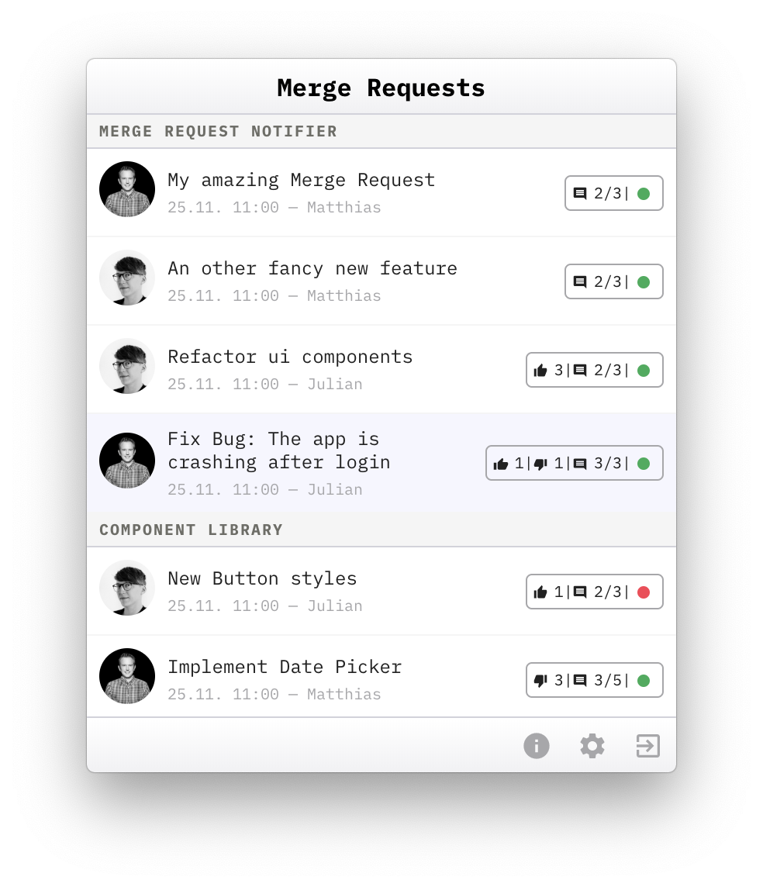
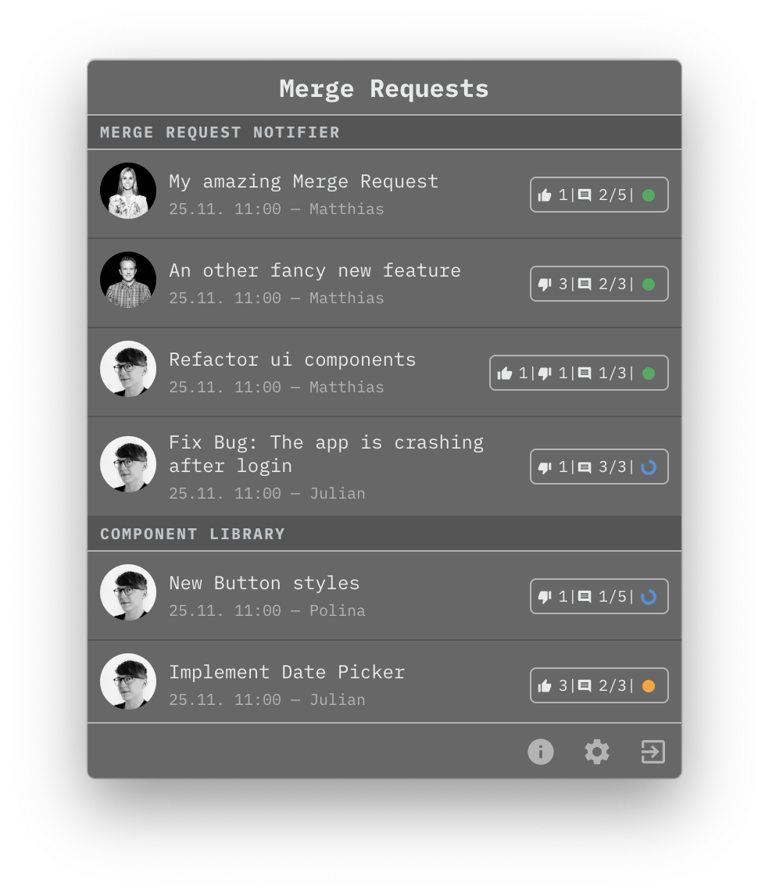
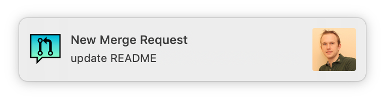
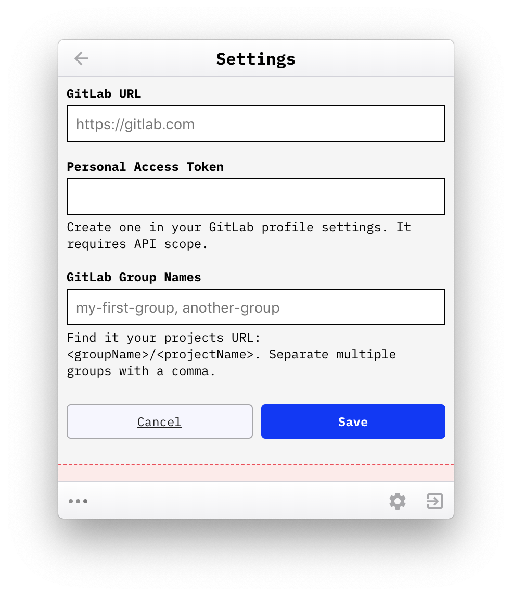
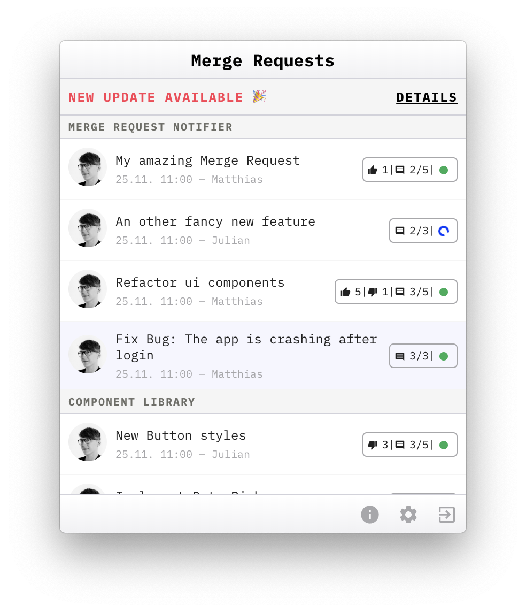
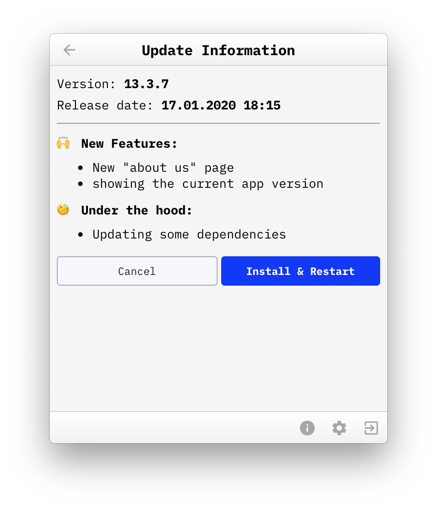

# Merge Request Notifier

[](https://travis-ci.org/codecentric/merge-request-notifier) 
[](https://greenkeeper.io/)

This app shows your merge quests grouped by projects and WIP status. It is accessible from the system tray.

| Light Mode  | Dark Mode |
| ------------- | ------------- |
|  |  |

## Notification
You will receive a desktop notification when a new merge request is created.



## Settings
In the settings you have to provide one of your personal access token to get access to your merge requests. 
You are able to configure multiple groups.



## App Updates
You will be always up to date with our integrated in app updates 🎉 Once there is a new update 
available you will be notified with a prominent alert above the merge requests. 



### Release Notes
On the details page you find the release notes from github.



## Installation
### From release page
The macOS installer is uploaded at the [releases page](https://github.com/codecentric/merge-request-notifier/releases).
Please download it and double click it to install.

**Merge.Request.Notifier-x.y.z.dmg**

### With homebrew-cask
If you're using homebrew-cask, this app can be installed via it. Please tap the repository URL and install this app via brew cask as follows.

```
brew tap codecentric/merge-request-notifier https://github.com/codecentric/merge-request-notifier
brew cask install merge-request-notifier
```
It's the easiest way to install and manage this app on macOS.

## Development
### Install all dependencies 

```bash
yarn install
```

### Usage
This will start the application with hot-reload so you can instantly start developing your application.

```bash
yarn start
```

### Logs
You will find the application logs in the following folder: `~/Library/Logs/merge-request-notifier/`

### New Releases
#### Create a new Release and Publish it
```bash
yarn dist
```
