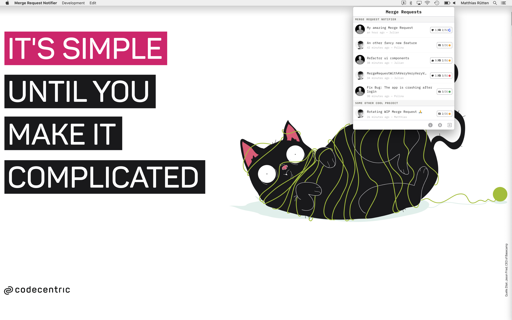

# Merge Request Notifier

This app shows your merge requests grouped by projects and WIP status. It is accessible from the system tray.

| Light Mode  | Dark Mode |
| ------------- | ------------- |
|  |  |

## Tray Icon
In the system tray you wil see the number of all open merge requests.



## Notification
You will receive a desktop notification when a new merge request is created.


## Settings
In the settings you have to provide one of your personal access token to get access to your merge requests. 
You are able to configure multiple groups.


## App Updates
You will be always up to date with our integrated in app updates 🎉 Once there is a new update 
available you will be notified with a prominent alert above the merge requests. On the details page you find the release notes from github. 

| New Update Alert  | Release Notes |
| ------------- | ------------- |
|  |  |

## Troubleshooting
### The tray icon is black even in dark mode
The tray icon color currently does not depend on your internal dark mode settings, but on the OS theme as detected via the Chromium engine. If the detection does not work, you may force dark mode on startup via `merge-request-notifier --force-dark-mode`.

## Installation
### macOS
#### From release page
The macOS and windows installer is uploaded at the [releases page](https://github.com/codecentric/merge-request-notifier/releases). Please download and double click it to install.

**Merge.Request.Notifier-x.y.z.dmg**

#### With homebrew-cask
If you're using homebrew-cask, this app can be installed via it. Please tap the repository URL and install this app via brew cask as follows.

```
brew tap codecentric/merge-request-notifier https://github.com/codecentric/merge-request-notifier
brew cask install merge-request-notifier
```
It's the easiest way to install and manage this app on macOS.

### Linux

#### Arch Linux

merge-request-notifier is available from the [AUR](https://aur.archlinux.org/packages/merge-request-notifier/). Install it using yay (or any other AUR helper):

```
$ yay -S merge-request-notifier
```

#### Other

Check the [releases](https://github.com/codecentric/merge-request-notifier/releases) page for packages for your distribution.

## Development
### Install all dependencies 

```bash
yarn install
```

### Usage
This will start the application with hot-reload so you can instantly start developing your application.

```bash
# start the renderer process with webpack-dev-server
yarn start-renderer

# start the main process (electron app)
yarn start-main
```

### Logs
You will find the application logs in the following folders

| OS  | Folder |
| ------------- | ------------- |
| Linux | ~/.config/merge-request-notifier/logs/{process type}.log |
| macOS | ~/Library/Logs/merge-request-notifier/{process type}.log |
| Windows | %USERPROFILE%\AppData\Roaming\merge-request-notifier\logs\{process type}.log |

### App Settings
You will find the application settings in the following folders

| OS  | Folder |
| ------------- | ------------- |
| Linux | $XDG_CONFIG_HOME/<Your App> or ~/.config/<Your App> |
| macOS | ~/Library/Application\ Support/<Your App> |
| Windows | %APPDATA%/<Your App> |


### New Releases
#### Create a new Release and Publish it
```bash
yarn dist
```
